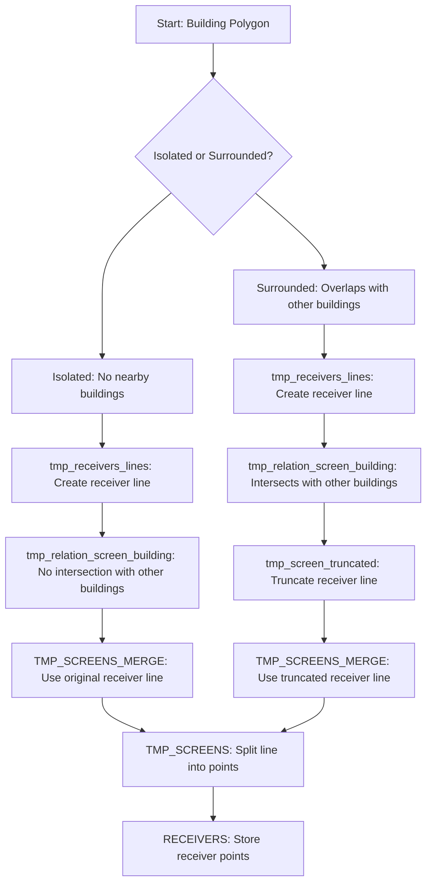

# NoiseProcesses

A python wrapper for NoiseModelling v4.0.

## Acknowledgment

This project is derived from the NoiseModelling project, an open-source tool for environmental noise mapping.

NoiseModelling is developed by the DECIDE team from the Lab-STICC (CNRS) and the Mixt Research Unit in Environmental Acoustics (Université Gustave Eiffel). You can find more information about NoiseModelling at [http://noise-planet.org/noisemodelling.html](http://noise-planet.org/noisemodelling.html).

NoiseModelling is distributed under the GNU General Public License v3.0.


## For Developers
### Python project setup 

This project uses a copier template for the basic project setup. 

```
# initial setup was done with:
copier copy git+https://USERNAME@bitbucket.org/geowerkstatt-hamburg/python_project_template --trust --vcs-ref main .
# !You dont need to do this again!
```

To update this projects underlying template:

```
# update
copier update . --trust
```

### Java setup

Use the `java_setup.sh` file to install java dependencies. Run:

```bash
# make it executable
chmod +x java_setup.sh

# run it
./setup.sh

# after that, source your bashrc or restart your terminal:
source ~/.bashrc

# verify your environment
echo $JAVA_HOME
java -version
mvn -version
```

### Build the java-based NoiseModelling library

To build run:

```
make check-java
make dist
```

## Notes

### Calculation of receivers along building facades



# LICENSE
This software is based on and uses components from [NoiseModelling](https://github.com/Universite-Gustave-Eiffel/NoiseModelling/) and is licenced under GPLv3.