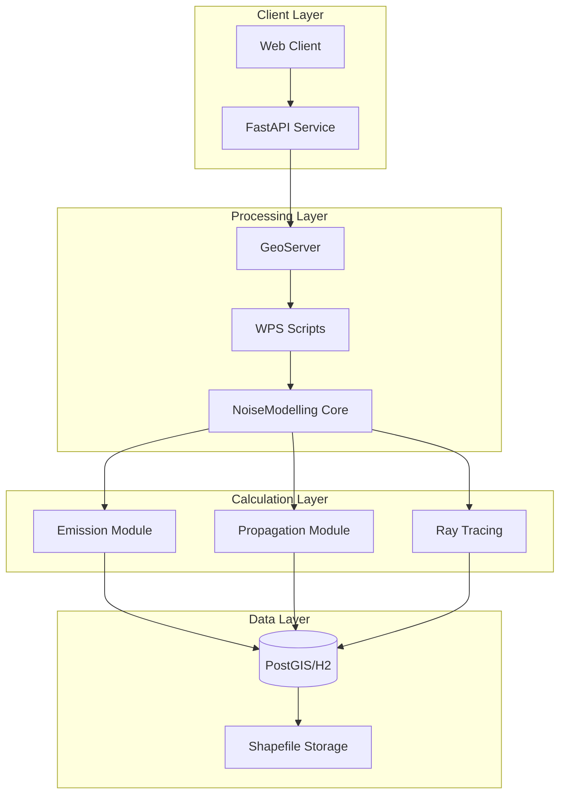
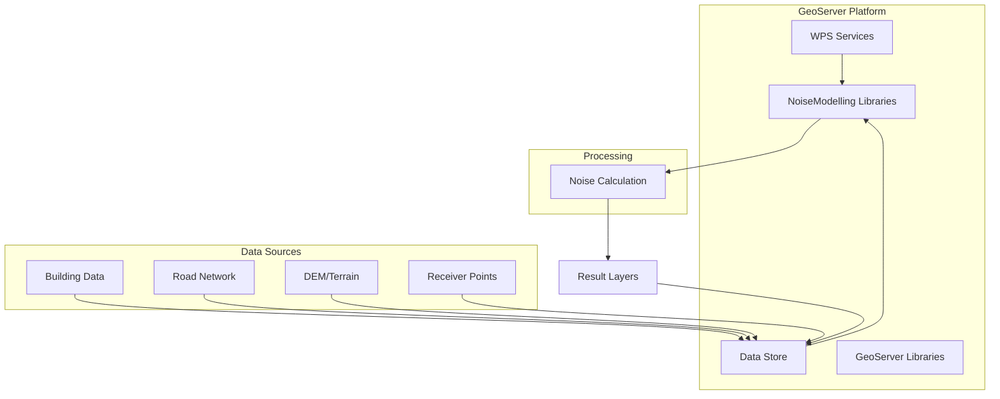
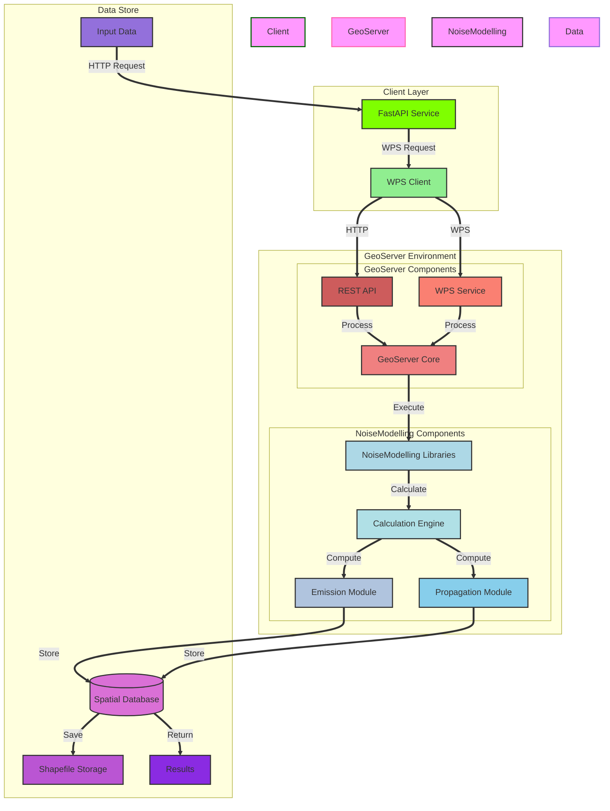
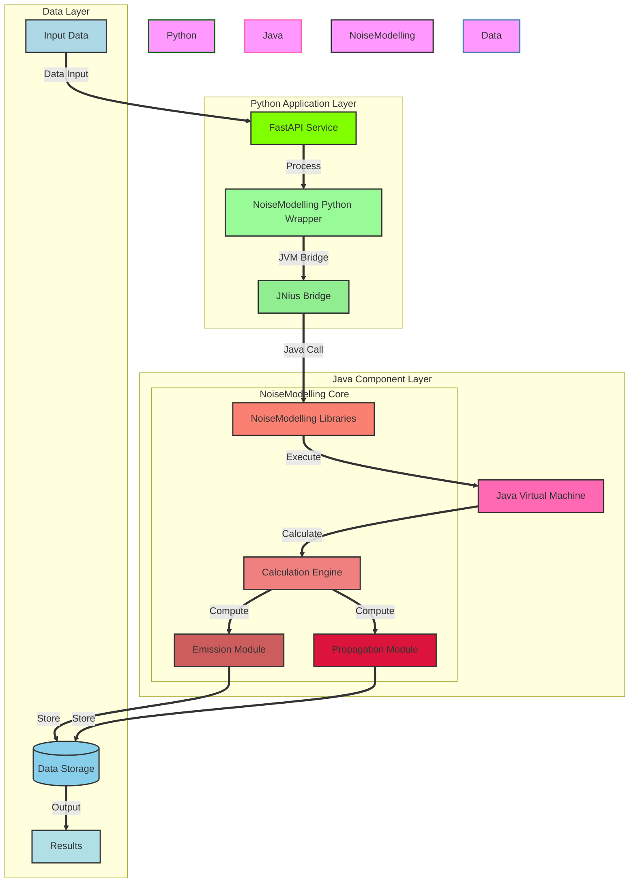
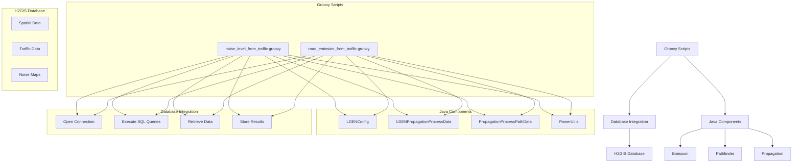

# WPS script integration approach

# direct Java classes interface (JNIUS) approach

## GeoServer

- necessary Using WPS interface
- spatial data management
- web service capabilities
- visualization features

## architecture

